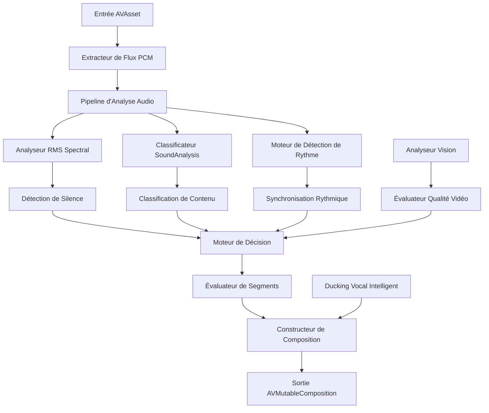

# Moteur Neural Auto-Cut - Document de Conception

## Vue d'ensemble

Le Moteur Neural Auto-Cut est un système sophistiqué de traitement vidéo qui transforme automatiquement le contenu vidéo brut en compositions polies en supprimant intelligemment les segments audio indésirables (silences, hésitations, sections de mauvaise qualité) tout en maintenant la synchronisation rythmique avec le contenu musical. Le système exploite les frameworks natifs macOS et la concurrence Swift 6 pour des performances optimales sur Apple Silicon.

## Architecture

### Architecture Système de Haut Niveau



### Composants Principaux

#### 1. Extracteur de Flux PCM
**Objectif** : Extraire efficacement les données audio des fichiers vidéo sans charger tout le contenu en mémoire.

**Implémentation** :
- Utilise `AVAssetReader` avec `AVAssetReaderAudioMixOutput`
- Traite l'audio par buffers de 1024 frames pour une utilisation mémoire optimale
- Supporte le format PCM Linear 32-bit float pour la précision
- Implémente une architecture de streaming pour gérer les fichiers 4K+

**Classes Clés** :
```swift
actor PCMStreamExtractor {
    private let assetReader: AVAssetReader
    private let audioOutput: AVAssetReaderAudioMixOutput
    private let bufferSize: Int = 1024
    
    func extractAudioStream() -> AsyncStream<AudioBuffer>
}
```

#### 2. Analyseur RMS Spectral
**Objectif** : Effectuer une analyse RMS en temps réel pour la détection de silence en utilisant des opérations vectorisées.

**Implémentation** :
- Exploite le framework Accelerate vDSP pour les opérations SIMD
- Calcule les valeurs RMS sur des fenêtres glissantes
- Implémente un seuillage adaptatif basé sur les caractéristiques du contenu
- Optimisé pour les performances Apple Silicon

**Classes Clés** :
```swift
actor SpectralRMSAnalyzer {
    private let vDSPProcessor: vDSP_Operations
    private var silenceThreshold: Float = -50.0 // dB
    private let windowSize: Int = 2048
    
    func analyzeRMS(_ buffer: AudioBuffer) -> RMSAnalysisResult
    func detectSilence(_ rmsValues: [Float]) -> [SilenceSegment]
}
```

#### 3. Classificateur SoundAnalysis
**Objectif** : Classifier le contenu audio en catégories Parole, Musique et Bruit en utilisant les modèles ML natifs d'Apple.

**Implémentation** :
- Utilise `SNClassifySoundRequest` du framework SoundAnalysis
- Traite l'audio par fenêtres d'1 seconde
- Fournit des scores de confiance pour chaque classification
- Implémente une logique de décision hiérarchique (Parole > Musique > Bruit)

**Classes Clés** :
```swift
actor SoundAnalysisClassifier {
    private let soundClassifier: SNAudioStreamAnalyzer
    private let classifyRequest: SNClassifySoundRequest
    
    func classifyAudio(_ buffer: AudioBuffer) async -> AudioClassification
}

struct AudioClassification {
    let speech: Float
    let music: Float
    let noise: Float
    let dominantType: AudioType
    let confidence: Float
}
```

#### 4. Moteur de Détection de Rythme
**Objectif** : Détecter les battements musicaux et les motifs rythmiques pour une coupe synchronisée.

**Implémentation** :
- Analyse le domaine fréquentiel pour la détection de transitoires
- Identifie les kicks, caisses claires et autres éléments percussifs
- Génère des marqueurs de timestamp précis pour l'alignement des battements
- Implémente le suivi de tempo pour un rythme cohérent

**Classes Clés** :
```swift
actor BeatDetectionEngine {
    private let fftProcessor: FFTProcessor
    private var detectedBeats: [BeatPoint] = []
    private var estimatedTempo: Float = 0.0
    
    func detectBeats(_ buffer: AudioBuffer) -> [BeatPoint]
    func alignCutPoints(_ segments: [AudioSegment]) -> [AudioSegment]
}

struct BeatPoint {
    let timestamp: CMTime
    let strength: Float
    let type: BeatType // kick, snare, hihat, etc.
}
```

#### 5. Moteur de Décision
**Objectif** : Combiner les résultats d'analyse pour prendre des décisions intelligentes de conservation/coupe.

**Implémentation** :
- Implémente un algorithme de notation pondérée
- Considère les niveaux RMS, la classification audio et l'alignement des battements
- Applique des règles configurables pour différents types de contenu
- Génère des scores de qualité pour chaque segment

**Classes Clés** :
```swift
actor DecisionEngine {
    private let scoringWeights: ScoringWeights
    private let contentRules: ContentRules
    
    func evaluateSegment(_ segment: AnalyzedSegment) -> SegmentDecision
    func generateQualityScore(_ segment: AnalyzedSegment) -> Float
}

struct SegmentDecision {
    let shouldKeep: Bool
    let qualityScore: Float
    let reasoning: DecisionReason
    let suggestedCutPoints: (CMTime, CMTime)?
}
```

#### 6. Constructeur de Composition
**Objectif** : Construire la composition vidéo finale avec mixage audio et fondus enchaînés.

**Implémentation** :
- Crée `AVMutableComposition` avec les segments sélectionnés
- Applique des fondus enchaînés automatiques en utilisant `AVMutableAudioMix`
- Implémente le ducking vocal intelligent avec `AVAudioMixInputParameters`
- Préserve la synchronisation vidéo-audio

**Classes Clés** :
```swift
actor CompositionBuilder {
    private var composition: AVMutableComposition
    private var audioMix: AVMutableAudioMix
    
    func buildComposition(_ segments: [ApprovedSegment]) async -> EditResult
    func applyCrossfades(_ segments: [ApprovedSegment])
    func implementVoiceDucking(_ segments: [ApprovedSegment])
}
```

## Modèles de Données

### Structures de Données Principales

```swift
// Modèles de données de traitement audio
struct AudioBuffer {
    let data: UnsafeBufferPointer<Float>
    let frameCount: Int
    let timestamp: CMTime
    let sampleRate: Double
}

struct AudioSegment {
    let startTime: CMTime
    let endTime: CMTime
    let rmsLevel: Float
    let classification: AudioClassification
    let beatAlignment: BeatAlignment?
    let qualityScore: Float
}

struct AnalyzedSegment {
    let segment: AudioSegment
    let silenceAnalysis: SilenceAnalysis
    let contentAnalysis: ContentAnalysis
    let rhythmAnalysis: RhythmAnalysis
    let videoQuality: VideoQualityScore?
}

// Modèles de configuration
struct ProcessingConfiguration {
    let silenceThreshold: Float // -60dB à -30dB
    let minimumSilenceDuration: TimeInterval // 100ms à 2s
    let speechSensitivity: SpeechSensitivity // faible, moyen, élevé
    let rhythmMode: RhythmMode // désactivé, modéré, agressif
    let enableVoiceDucking: Bool
    let enableVideoAnalysis: Bool
}

// Modèles de sortie
struct EditResult {
    let composition: AVMutableComposition
    let audioMix: AVMutableAudioMix
    let statistics: EditStatistics
    let timeline: [TimelineSegment]
}

struct EditStatistics {
    let originalDuration: TimeInterval
    let finalDuration: TimeInterval
    let reductionPercentage: Float
    let segmentsKept: Int
    let segmentsRemoved: Int
    let qualityScore: Float
}
```

### Modèles de Gestion Mémoire

```swift
// Optimisation mémoire Swift 6
struct AudioBufferSpan {
    let span: Span<Float>
    let metadata: AudioMetadata
}

// Gestion de buffer sans copie
actor BufferPool {
    private var availableBuffers: [AudioBuffer] = []
    private let maxPoolSize: Int = 10
    
    func acquireBuffer() -> AudioBuffer
    func releaseBuffer(_ buffer: AudioBuffer)
}
```

## Composants et Interfaces

### Interfaces Principales

#### NeuralAutoCutEngine (Interface Principale)
```swift
@MainActor
public class NeuralAutoCutEngine: ObservableObject {
    @Published public var progress: Float = 0.0
    @Published public var status: ProcessingStatus = .idle
    @Published public var statistics: EditStatistics?
    
    public func processVideo(
        asset: AVAsset,
        configuration: ProcessingConfiguration
    ) async throws -> EditResult
    
    public func previewSegments(
        asset: AVAsset,
        configuration: ProcessingConfiguration
    ) async throws -> [PreviewSegment]
    
    public func cancelProcessing()
}
```

#### AudioAnalysisPipeline (Traitement Principal)
```swift
actor AudioAnalysisPipeline {
    private let pcmExtractor: PCMStreamExtractor
    private let rmsAnalyzer: SpectralRMSAnalyzer
    private let soundClassifier: SoundAnalysisClassifier
    private let beatDetector: BeatDetectionEngine
    private let decisionEngine: DecisionEngine
    
    func analyzeAudio(_ asset: AVAsset) -> AsyncStream<AnalyzedSegment>
    func processBuffer(_ buffer: AudioBuffer) async -> SegmentAnalysis
}
```

#### VisionAnalysisEngine (Évaluation Qualité Vidéo)
```swift
actor VisionAnalysisEngine {
    private let visionProcessor: VNImageRequestHandler
    private let qualityAssessment: VideoQualityAssessment
    
    func analyzeVideoQuality(_ asset: AVAsset) -> AsyncStream<VideoQualityScore>
    func assessFrameQuality(_ frame: CVPixelBuffer) async -> FrameQualityScore
}
```

### Interfaces de Configuration

#### ProcessingConfigurationBuilder
```swift
public struct ProcessingConfigurationBuilder {
    public static func defaultConfiguration() -> ProcessingConfiguration
    public static func podcastConfiguration() -> ProcessingConfiguration
    public static func musicVideoConfiguration() -> ProcessingConfiguration
    public static func presentationConfiguration() -> ProcessingConfiguration
    
    public func withSilenceThreshold(_ threshold: Float) -> Self
    public func withRhythmMode(_ mode: RhythmMode) -> Self
    public func withVoiceDucking(_ enabled: Bool) -> Self
}
```

## Gestion d'Erreurs

### Types d'Erreurs
```swift
public enum NeuralAutoCutError: Error, LocalizedError {
    case invalidAsset(String)
    case unsupportedFormat(String)
    case processingFailed(String)
    case insufficientMemory
    case cancelled
    case configurationError(String)
    
    public var errorDescription: String? {
        switch self {
        case .invalidAsset(let message):
            return "Asset invalide : \(message)"
        case .unsupportedFormat(let format):
            return "Format non supporté : \(format)"
        case .processingFailed(let reason):
            return "Échec du traitement : \(reason)"
        case .insufficientMemory:
            return "Mémoire insuffisante pour le traitement"
        case .cancelled:
            return "Le traitement a été annulé"
        case .configurationError(let message):
            return "Erreur de configuration : \(message)"
        }
    }
}
```

### Stratégies de Récupération d'Erreurs
- **Pression mémoire** : Réduction automatique de la taille des buffers et garbage collection
- **Échecs de traitement** : Fallback vers des algorithmes plus simples avec qualité réduite
- **Problèmes de format** : Transcodage automatique vers des formats supportés
- **Annulation** : Nettoyage propre des ressources et restauration d'état

## Stratégie de Test

L'approche de test combine des tests unitaires pour des composants spécifiques avec des tests basés sur les propriétés pour des garanties de correction universelles.

### Focus des Tests Unitaires
- Exemples spécifiques de traitement audio avec entrées/sorties connues
- Cas limites comme audio vide, niveaux de volume extrêmes, données corrompues
- Points d'intégration entre composants d'analyse audio
- Conditions d'erreur et mécanismes de récupération
- Validation de configuration et conditions limites

### Focus des Tests Basés sur les Propriétés
- Propriétés universelles qui doivent être vraies pour toutes les entrées valides
- Couverture d'entrée complète par randomisation
- Propriétés de correction dérivées de l'analyse des exigences
- Minimum 100 itérations par test de propriété pour la confiance statistique

*Une propriété est une caractéristique ou un comportement qui doit être vrai pour toutes les exécutions valides d'un système—essentiellement, une déclaration formelle sur ce que le système devrait faire. Les propriétés servent de pont entre les spécifications lisibles par l'homme et les garanties de correction vérifiables par machine.*

## Propriétés de Correction

Basées sur l'analyse des exigences, les propriétés suivantes doivent être vraies pour toutes les exécutions système valides :

### Propriétés d'Extraction Audio

**Propriété 1 : Cohérence Format PCM**
*Pour tout* AVAsset d'entrée valide, les données audio extraites doivent être au format PCM Linear 32-bit float
**Valide : Exigences 1.1**

**Propriété 2 : Traitement à Mémoire Bornée**
*Pour toute* taille de fichier d'entrée, l'utilisation mémoire doit rester bornée et ne pas dépasser les limites système quelle que soit la durée du fichier
**Valide : Exigences 1.2**

**Propriété 3 : Traitement Gros Fichiers**
*Pour tout* fichier vidéo (y compris 4K+), le traitement doit se terminer avec succès sans erreurs ni plantages
**Valide : Exigences 1.3**

**Propriété 4 : Cohérence Taille Buffer**
*Pour tout* flux audio, le traitement doit se faire par buffers d'exactement 1024 frames
**Valide : Exigences 1.4**

### Propriétés d'Analyse Spectrale

**Propriété 5 : Précision Calcul RMS**
*Pour tout* buffer audio, les valeurs RMS calculées doivent correspondre au calcul RMS mathématiquement correct dans la précision des nombres flottants
**Valide : Exigences 2.1**

**Propriété 6 : Équivalence Framework Accelerate**
*Pour tout* buffer audio, les calculs accélérés vDSP doivent produire des résultats équivalents aux implémentations de référence
**Valide : Exigences 2.2**

**Propriété 7 : Seuil Silence Configurable**
*Pour tout* seuil de silence configuré, la détection de silence doit respecter le niveau dB spécifié
**Valide : Exigences 2.4**

### Propriétés de Détection de Silence

**Propriété 8 : Comportement Seuil Adaptatif**
*Pour tout* type de contenu, les seuils de silence doivent s'adapter appropriément aux caractéristiques audio
**Valide : Exigences 3.1**

**Propriété 9 : Durée Minimale Silence**
*Pour tout* silence détecté, seuls les segments plus longs que la durée minimale configurée doivent être marqués pour suppression
**Valide : Exigences 3.2**

**Propriété 10 : Préservation Classification Musique**
*Pour tout* contenu musical d'ambiance, il ne doit pas être incorrectement classifié comme silence
**Valide : Exigences 3.4**

### Propriétés de Classification Sonore

**Propriété 11 : Utilisation API SoundAnalysis**
*Pour toute* entrée audio, le système doit utiliser SNClassifySoundRequest et retourner des classifications Parole/Musique/Bruit valides
**Valide : Exigences 4.1**

**Propriété 12 : Classification Par Seconde**
*Pour tout* flux audio, les classifications doivent être fournies pour chaque seconde de contenu audio
**Valide : Exigences 4.2**

**Propriété 13 : Validité Score Confiance**
*Pour tout* résultat de classification, les scores de confiance doivent être fournis et dans la plage valide [0.0, 1.0]
**Valide : Exigences 4.3**

**Propriété 14 : Logique Décision Hiérarchique**
*Pour toute* classification avec plusieurs résultats haute confiance, la hiérarchie Parole > Musique > Bruit doit être appliquée
**Valide : Exigences 4.4**

### Propriétés de Logique de Décision

**Propriété 15 : Préservation Parole**
*Pour tout* segment avec parole détectée, le segment doit être préservé quels que soient les autres facteurs
**Valide : Exigences 5.1**

**Propriété 16 : Logique Suppression Bruit**
*Pour tout* segment classifié comme bruit avec faible volume, le segment doit être automatiquement marqué pour suppression
**Valide : Exigences 5.2**

**Propriété 17 : Préservation Musique**
*Pour tout* segment classifié comme musique, le segment doit être préservé pour les transitions/fond sonore
**Valide : Exigences 5.3**

**Propriété 18 : Règles Contenu Configurables**
*Pour toute* configuration de type de contenu, les règles de décision appropriées doivent être appliquées de manière cohérente
**Valide : Exigences 5.4**

### Propriétés de Détection de Rythme

**Propriété 19 : Précision Détection Transitoires**
*Pour tout* audio avec éléments percussifs, les kicks et caisses claires doivent être correctement identifiés par analyse fréquentielle
**Valide : Exigences 6.1**

**Propriété 20 : Précision Point de Rythme**
*Pour tout* rythme détecté, le BeatPoint généré doit avoir un timestamp précis à ±10ms près
**Valide : Exigences 6.2**

**Propriété 21 : Alignement Coupe**
*Pour tout* point de coupe généré, il doit s'aligner soit sur un rythme détecté soit sur un passage par zéro
**Valide : Exigences 6.3**

**Propriété 22 : Prévention Artefacts Audio**
*Pour toute* opération de coupe, aucun clic ou artefact audible ne doit être introduit
**Valide : Exigences 6.4**

### Propriétés de Synchronisation Rythmique

**Propriété 23 : Ajustement Alignement Rythme**
*Pour tout* point de coupe près d'un rythme détecté, le point doit être automatiquement ajusté pour s'aligner avec le rythme
**Valide : Exigences 7.1**

**Propriété 24 : Cohérence Tempo**
*Pour tout* contenu musical avec tempo détecté, les coupes doivent maintenir la cohérence rythmique
**Valide : Exigences 7.2**

**Propriété 25 : Transitions Fluides**
*Pour tous* segments adjacents dans la composition finale, les transitions doivent être fluides sans changements abrupts
**Valide : Exigences 7.3**

**Propriété 26 : Préservation Rythme Global**
*Pour tout* contenu musical, la composition finale doit préserver la cohérence rythmique globale
**Valide : Exigences 7.4**

### Propriétés de Concurrence

**Propriété 27 : Isolation Données Actor**
*Pour tout* accès concurrent aux données partagées, le modèle Actor doit prévenir les data races et assurer l'isolation
**Valide : Exigences 8.1, 8.4**

**Propriété 28 : Traitement Asynchrone**
*Pour toute* opération de traitement, elle doit s'exécuter de manière asynchrone sans bloquer le thread appelant
**Valide : Exigences 8.2**

### Propriétés de Gestion Mémoire

**Propriété 29 : Opérations Buffer Sans Copie**
*Pour toute* manipulation de buffer utilisant Span, aucune copie mémoire inutile ne doit être effectuée
**Valide : Exigences 9.1**

**Propriété 30 : Efficacité Allocation Mémoire**
*Pour toute* opération de traitement, les allocations mémoire doivent être minimisées et réutiliser les buffers existants quand possible
**Valide : Exigences 9.2**

**Propriété 31 : Gestion Gros Buffers**
*Pour tout* gros buffer audio, le système doit le gérer efficacement sans pression mémoire
**Valide : Exigences 9.3**

**Propriété 32 : Mise à l'Échelle Performance Linéaire**
*Pour toute* taille de fichier d'entrée, le temps de traitement doit évoluer linéairement avec la durée
**Valide : Exigences 9.4**

### Propriétés de Construction Composition

**Propriété 33 : Validité Structure Composition**
*Pour toute* AVMutableComposition générée, elle doit avoir une structure valide et être lisible
**Valide : Exigences 10.1**

**Propriété 34 : Filtrage Score Qualité**
*Pour tout* segment dans la composition finale, son score de qualité doit être au-dessus du seuil configuré (défaut 40)
**Valide : Exigences 10.2**

**Propriété 35 : Synchronisation Audio-Vidéo**
*Pour toute* vidéo traitée, les pistes audio et vidéo doivent rester synchronisées à ±1 frame près
**Valide : Exigences 10.3**

**Propriété 36 : Préservation Métadonnées**
*Pour toute* vidéo d'entrée avec métadonnées, les métadonnées originales doivent être préservées dans la composition de sortie
**Valide : Exigences 10.4**

### Propriétés de Fondu Enchaîné

**Propriété 37 : Application Automatique Fondu Enchaîné**
*Pour toute* jonction de segment, un fondu enchaîné de 20ms doit être automatiquement appliqué
**Valide : Exigences 11.1**

**Propriété 38 : Utilisation API AudioMix**
*Pour toute* transition, AVMutableAudioMix doit être utilisé pour implémenter les fondus enchaînés
**Valide : Exigences 11.2**

**Propriété 39 : Lissage Coupe Abrupte**
*Pour toute* coupe potentiellement abrupte, elle doit être lissée pour prévenir les artefacts audio
**Valide : Exigences 11.3**

**Propriété 40 : Préservation Qualité Audio**
*Pour tout* audio traité, les métriques de qualité doivent être maintenues dans des tolérances acceptables
**Valide : Exigences 11.4**

### Propriétés de Ducking Vocal

**Propriété 41 : Détection Zone Parole**
*Pour tout* contenu audio, les zones de parole doivent être détectées avec précision pour le ducking vocal
**Valide : Exigences 12.1**

**Propriété 42 : Réduction Musique de Fond**
*Pour toute* zone de parole détectée, la musique de fond doit être automatiquement réduite de 15dB
**Valide : Exigences 12.2**

**Propriété 43 : Utilisation Paramètres Audio Mix**
*Pour toute* opération de ducking vocal, AVAudioMixInputParameters doit être utilisé pour l'automation
**Valide : Exigences 12.3**

**Propriété 44 : Transitions Niveau Fluides**
*Pour toute* transition de ducking vocal, les changements de niveau doivent être fluides sans sauts abrupts
**Valide : Exigences 12.4**

### Propriétés d'Intégration Vision

**Propriété 45 : Traitement Parallèle**
*Pour toute* entrée vidéo, l'analyse audio et vidéo doit s'exécuter en parallèle en utilisant TaskGroup
**Valide : Exigences 13.1**

**Propriété 46 : Prise de Décision Multi-Modale**
*Pour tout* segment avec bon audio mais mauvaise qualité vidéo, le segment doit être rejeté
**Valide : Exigences 13.2**

**Propriété 47 : Intégration Score Esthétique**
*Pour toute* évaluation de segment, les scores esthétiques doivent être correctement intégrés dans le processus de décision
**Valide : Exigences 13.3**

**Propriété 48 : Logique Remplacement B-Roll**
*Pour tout* segment rejeté avec B-roll disponible, le remplacement automatique doit se produire quand approprié
**Valide : Exigences 13.4**

## Stratégie de Test

### Approche de Test Duale

Le système emploie à la fois des tests unitaires et des tests basés sur les propriétés pour une couverture complète :

**Tests Unitaires** se concentrent sur :
- Exemples spécifiques de traitement audio avec entrées connues et sorties attendues
- Cas limites comme buffers audio vides, niveaux de volume extrêmes, données corrompues
- Points d'intégration entre composants d'analyse audio (extraction PCM → analyse RMS → classification)
- Conditions d'erreur et mécanismes de récupération
- Validation de configuration et conditions limites
- Optimisations spécifiques à la plateforme (Apple Silicon vs Intel)

**Tests Basés sur les Propriétés** se concentrent sur :
- Propriétés universelles qui doivent être vraies pour toutes les entrées valides
- Couverture d'entrée complète par génération audio randomisée
- Propriétés de correction dérivées de l'analyse des exigences
- Validation statistique avec minimum 100 itérations par propriété

### Configuration Tests Basés sur les Propriétés

Le système utilise le framework **Swift Testing** avec **SwiftCheck** pour les tests basés sur les propriétés :

- **Minimum 100 itérations** par test de propriété pour la confiance statistique
- **Générateurs audio personnalisés** pour créer des entrées de test diverses
- **Étiquetage des tests de propriété** avec format : **Feature: neural-auto-cut, Property {numéro}: {texte_propriété}**
- **Exécution de test parallèle** exploitant Swift Concurrency
- **Test de pression mémoire** avec simulation de gros fichiers

### Stratégie de Données de Test

**Données de Test Audio** :
- Audio synthétique avec caractéristiques connues (tons purs, bruit blanc, échantillons de parole)
- Échantillons audio du monde réel couvrant différents types de contenu (podcasts, musique, présentations)
- Audio de cas limites (silence, écrêtage, très basses/hautes fréquences)
- Contenu multi-canal et divers taux d'échantillonnage

**Données de Test Vidéo** :
- Divers codecs (H.264, HEVC, ProRes) et résolutions (1080p, 4K, 8K)
- Différents taux d'images (24fps, 30fps, 60fps, 120fps)
- Contenu avec qualité visuelle variable (net, flou, flou de mouvement)

### Test de Performance

**Stratégie de Benchmarking** :
- Mesure du temps de traitement pour différentes tailles de fichiers
- Profilage de l'utilisation mémoire pendant le traitement
- Surveillance de l'utilisation CPU sur Apple Silicon vs Intel
- Comparaison avec les implémentations de référence

**Objectifs de Performance** :
- Temps d'analyse < 10% de la durée source
- Utilisation mémoire < 2GB quelle que soit la taille source
- Utilisation CPU < 80% sur Apple Silicon
- Performance temps réel ou mieux pour la plupart des types de contenu